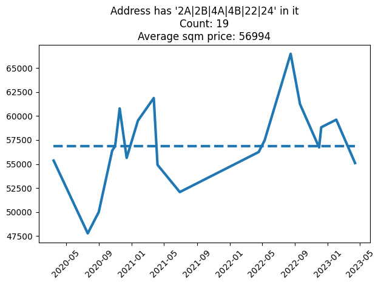

# Apartments analysis

Welcome to my automated analysis of apartments in Copenhagen.
This is a toy project to try out [git scraping](https://simonwillison.net/2020/Oct/9/git-scraping).

# Analysis

|    | address                | sales_date   |   sqm |   price |   sqm_price |
|---:|:-----------------------|:-------------|------:|--------:|------------:|
|  0 | Prinsessegade 4A, 3 67 | 13-04-2023   |    49 | 2700000 |       55102 |
|  3 | Prinsessegade 2B, 1 77 | 02-02-2023   |    52 | 3100000 |       59615 |
|  4 | Prinsessegade 4A, 3 69 | 08-12-2022   |    51 | 3000000 |       58824 |
|  6 | Prinsessegade 2B, 2 81 | 30-11-2022   |    52 | 2950000 |       56731 |
|  7 | Prinsessegade 4A, 1 59 | 20-09-2022   |    49 | 3000000 |       61224 |
|  9 | Prinsessegade 4A, 3 66 | 16-08-2022   |    51 | 3390000 |       66471 |
| 11 | Prinsessegade 2A, 1 tv | 11-05-2022   |    67 | 3850000 |       57463 |
| 12 | Prinsessegade 4B, 1 40 | 19-04-2022   |    48 | 2700000 |       56250 |
| 17 | Prinsessegade 4B, 1 39 | 29-06-2021   |    48 | 2500000 |       52083 |
|  7 | Sofiegade 24, 1 9      | 07-04-2021   |    59 | 3240000 |       54915 |
|  9 | Sofiegade 24, 3 26     | 24-03-2021   |    38 | 2351000 |       61868 |
| 24 | Prinsessegade 2B, 3 85 | 24-01-2021   |    52 | 3095000 |       59519 |
| 26 | Prinsessegade 2A, 2 th | 13-12-2020   |    70 | 3895000 |       55643 |
| 27 | Prinsessegade 2B, 2 84 | 17-11-2020   |    51 | 3100000 |       60784 |
| 29 | Prinsessegade 4A, 1 58 | 31-10-2020   |    51 | 2900000 |       56863 |
| 30 | Prinsessegade 2B, 2 82 | 20-10-2020   |    47 | 2650000 |       56383 |
| 10 | Sofiegade 24, 1 10     | 31-08-2020   |    38 | 1900000 |       50000 |
| 31 | Prinsessegade 2A, 1 th | 21-07-2020   |    70 | 3345000 |       47786 |
| 33 | Prinsessegade 4A, 2 64 | 16-03-2020   |    49 | 2712500 |       55357 |
